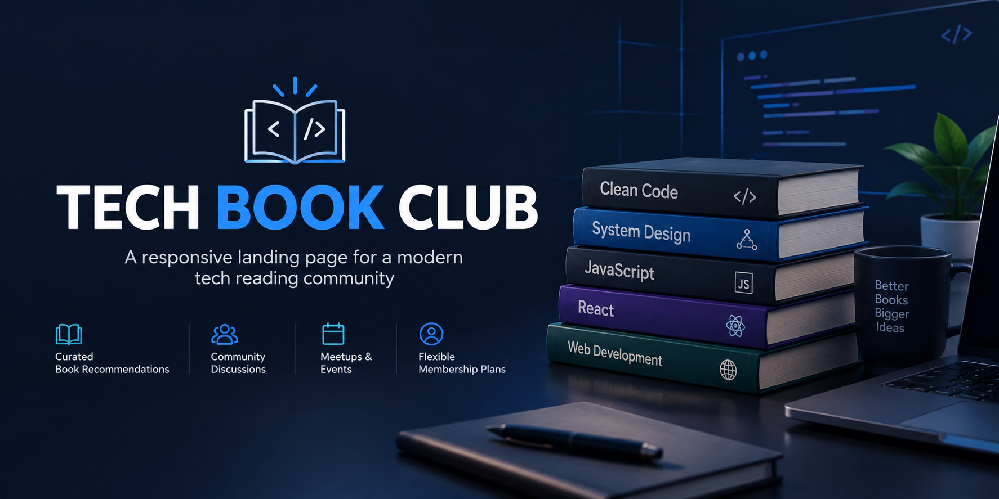

# Tech Book Club 📚💻

A modern and responsive landing page for a tech-focused book club, designed to connect developers and technology enthusiasts through curated books, community discussions, and exclusive events.



---

## 🎯 About the Project

**Tech Book Club** is a responsive landing page created for a fictional community focused on technology and software development books.

The project presents the club's benefits, membership plans, reading journey, and community features through a clean and modern interface.

The main goal was to practice building a complete responsive landing page while focusing on layout, typography, accessibility, and responsive design.

---

## ✨ Features

- 📚 Curated technology book recommendations
- 💬 Community discussions
- 🗓️ Virtual and in-person meetups
- 🚀 Early access to new technology book releases
- 🎤 Author Q&A sessions
- 💳 Different membership plans
- 📱 Fully responsive design
- ♿ Accessible HTML structure
- 🎨 Modern and clean user interface

---

## 🛠️ Technologies

- **HTML5** – Semantic page structure
- **CSS3** – Styling, layout, animations, and responsive design
- **JavaScript** – Interactive functionality
- **SCSS** – Organized and maintainable stylesheets
- **Git & GitHub** – Version control and project management

---

## 📱 Responsive Design

The landing page was designed to provide a consistent experience across different screen sizes, including:

- Desktop
- Laptop
- Tablet
- Mobile devices

The layout adapts to smaller screens using responsive CSS techniques and media queries.

---

## 🚀 Live Demo

You can view the live project here:

**[Tech Book Club – Live Demo](https://melodious-cassata-4c4424.netlify.app/)**

---

## 📸 Preview

The project includes several sections designed to present the Tech Book Club experience:

- Hero section
- Community benefits
- Reading journey
- Membership plans
- Customer testimonial
- Call-to-action section

---

## 📚 What I Learned

While developing this project, I practiced and improved my knowledge of:

- Semantic HTML
- Responsive layouts
- CSS Grid and Flexbox
- SCSS organization
- Media queries
- Typography and spacing
- Responsive images
- Accessibility
- Component-like CSS organization
- Building landing pages from a design

This project was also an opportunity to improve my attention to detail when reproducing a professional interface from a design.

---

## 💻 Getting Started

To run the project locally, clone the repository:

```bash
git clone https://github.com/your-username/tech-book-club.git
```

Navigate to the project directory:

```bash
cd tech-book-club
```

Then open the `index.html` file in your browser.

---

## 👨‍💻 Author

Developed by **Vinicius Henrique**.

If you enjoyed the project, feel free to ⭐ the repository!
